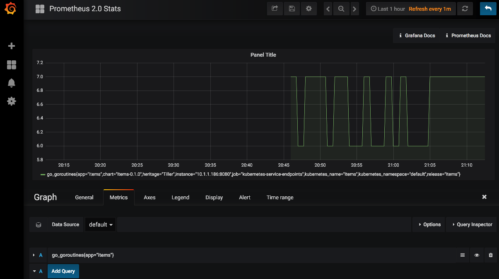

# metrics-tutorial
This tutorial will walk through the following:
- install promethus & grafana using helm
- add metrics to a docker service and deploy it to kubernetes
- monitor the service from grafana

**Prerequisites**: install docker, Kubernetes and helm and clone repo.


Install Prometheus
```
$ $ helm install --name prometheus stable/prometheus
NAME:   prometheus
...
For more information on running Prometheus, visit:
https://prometheus.io/

$ helm ls
NAME      	REVISION	UPDATED                 	STATUS  	CHART           	NAMESPACE
prometheus	1       	Sat Apr  7 09:40:01 2018	DEPLOYED	prometheus-6.1.1	default  

$ kubectl get pods
NAME                                             READY     STATUS    RESTARTS   AGE
prometheus-alertmanager-85d944f874-g5znl         1/2       Running   0          45s
prometheus-kube-state-metrics-786b6cbc77-bwhv4   1/1       Running   0          45s
prometheus-node-exporter-9h8p4                   1/1       Running   0          45s
prometheus-pushgateway-68966b6ff7-p4rgs          1/1       Running   0          45s
prometheus-server-6966b574d7-6tm8g               1/2       Running   0          45s

```

Port forward Prometheus to open in the browser
```
$ kubectl port-forward prometheus-server-6966b574d7-6tm8g 9090
Forwarding from 127.0.0.1:9090 -> 9090
```
> Browse to http://localhost:9090/graph to see Prometheus


Install Granafa
```
$ helm install --name grafana stable/grafana
NAME:   grafana
...
NOTES:
1. Get your 'admin' user password by running:

   kubectl get secret --namespace default grafana -o jsonpath="{.data.grafana-admin-password}" | base64 --decode ; echo

2. The Grafana server can be accessed via port 80 on the following DNS name from within your cluster:

   grafana.default.svc.cluster.local

   Get the Grafana URL to visit by running these commands in the same shell:

     export POD_NAME=$(kubectl get pods --namespace default -l "app=grafana-grafana,component=grafana" -o jsonpath="{.items[0].metadata.name}")
     kubectl --namespace default port-forward $POD_NAME 3000

3. Login with the password from step 1 and the username: admin

```

Generate admin password
```
$ kubectl get secret --namespace default grafana -o jsonpath="{.data.grafana-admin-password}" | base64 --decode ; echo
xxxxxxxx
```

Port forward Grafana
```
$ kubectl get pods
NAME                                             READY     STATUS    RESTARTS   AGE
grafana-55b57d567b-2gvtk                         0/1       Running   0          12s
prometheus-alertmanager-85d944f874-64ml2         2/2       Running   0          2m
prometheus-kube-state-metrics-786b6cbc77-v8cxd   1/1       Running   0          2m
prometheus-node-exporter-76tsc                   1/1       Running   0          2m
prometheus-pushgateway-68966b6ff7-kgmf8          1/1       Running   0          2m
prometheus-server-6966b574d7-5xjrz               2/2       Running   0          2m


$ kubectl port-forward grafana-55b57d567b-2gvtk 3000
Forwarding from 127.0.0.1:3000 -> 3000
```

> Browse to http://localhost:3000 to see Grafana


Configure Grafana to connect to Prometheus:


Build the docker image locally which contains the service we want to monitor:
```
$ make build-docker
./build-docker.sh metrics-tutorial latest Dockerfile
Sending build context to Docker daemon  198.1kB
Step 1/19 : FROM golang:1.10-alpine AS builder
1.10-alpine: Pulling from library/golang
ff3a5c916c92: Already exists
f32d2ea73378: Pull complete
dbfec4c268d3: Pull complete
...Successfully built 3af201e32085
Successfully tagged metrics-tutorial:latest
```

Try out the service
```
$ docker-compose up -d
Starting items ... done

$ curl localhost:8080/items
[{"item":"apple"}, {"item":"orange"}, {"item":"pear"}]

$ docker-compose down
```

Deploy the service to Kubernetes using Helm
```
$ helm install --name items ./charts/items
```

Verify the service is running in Kubernetes
```
$ kubectl port-forward items-d5b6bf545-fxh9z 8080
(from another terminal session)
$ curl localhost:8080/items
[{"item":"apple"}, {"item":"orange"}, {"item":"pear"}]
```


add prometheus client and metrics handler
```
$ vi main.go
import (
	"io"
	"math/rand"
	"net/http"
	"os"
	"strconv"
  // -----------------------------------------------
  //
	"github.com/prometheus/client_golang/prometheus/promhttp"
  //
  //           ^^^ add line    
	// -----------------------------------------------
)

// ItemList : list of items
type ItemList []struct {
	Item string `json:"item"`
}

func main() {
	http.HandleFunc("/items", items)
	http.HandleFunc("/", health)

	// -----------------------------------------------
	//
  http.Handle("/metrics", promhttp.Handler())
  //
  //           ^^^ add line    
	// -----------------------------------------------
```

get prometheus go client
```
$vi build.sh
(add go get before go build)
go get github.com/prometheus/client_golang/prometheus

```

update the service.yaml file to enable prometheus:
```
$ vi charts/items/templates/service.yaml
apiVersion: v1
kind: Service
metadata:
  name: {{ template "items.fullname" . }}
  labels:
    app: {{ template "items.name" . }}
    chart: {{ template "items.chart" . }}
    release: {{ .Release.Name }}
    heritage: {{ .Release.Service }}
  # -------------------------------------------
  #
  annotations:
    prometheus.io/scrape: "true"
    prometheus.io/port: {{ .Values.service.port | quote }}
  #
  #             ^^^ add lines
  # -------------------------------------------
spec:
  type: {{ .Values.service.type }}
  ports:
    - port: {{ .Values.service.port }}
      targetPort: http
      protocol: TCP
      name: http
  selector:
    app: {{ template "items.name" . }}
    release: {{ .Release.Name }}
```

build container and re-install chart
```
$ make build-docker

$ helm del --purge items
$ helm install --name items ./charts/items
```

verify that the /metrics endpoint is working:
```
$ curl localhost:8080/metrics
# HELP go_gc_duration_seconds A summary of the GC invocation durations.
# TYPE go_gc_duration_seconds summary
go_gc_duration_seconds{quantile="0"} 0.0001366
go_gc_duration_seconds{quantile="0.25"} 0.0002358
go_gc_duration_seconds{quantile="0.5"} 0.0003888
go_gc_duration_seconds{quantile="0.75"} 0.0006234
go_gc_duration_seconds{quantile="1"} 0.0429821
go_gc_duration_seconds_sum 0.0552098
go_gc_duration_seconds_count 31
# HELP go_goroutines Number of goroutines that currently exist.
# TYPE go_goroutines gauge
go_goroutines 7
# HELP go_info Information about the Go environment.
# TYPE go_info gauge
go_info{version="go1.10.1"} 1
# HELP go_memstats_alloc_bytes Number of bytes allocated and still in use.
# TYPE go_memstats_alloc_bytes gauge
go_memstats_alloc_bytes 3.431992e+06
# HELP go_memstats_alloc_bytes_total Total number of bytes allocated, even if freed.
# TYPE go_memstats_alloc_bytes_total counter
go_memstats_alloc_bytes_total 6.5987736e+07
# HELP go_memstats_buck_hash_sys_bytes Number of bytes used by the profiling bucket hash table.
# TYPE go_memstats_buck_hash_sys_bytes gauge
go_memstats_buck_hash_sys_bytes 1.447556e+06
# HELP go_memstats_frees_total Total number of frees.
# TYPE go_memstats_frees_total counter
go_memstats_frees_total 112770
# HELP go_memstats_gc_cpu_fraction The fraction of this program's available CPU time used by the GC since the program started.
# TYPE go_memstats_gc_cpu_fraction gauge
go_memstats_gc_cpu_fraction 1.7233470012436766e-05
# HELP go_memstats_gc_sys_bytes Number of bytes used for garbage collection system metadata.
# TYPE go_memstats_gc_sys_bytes gauge
go_memstats_gc_sys_bytes 405504
# HELP go_memstats_heap_alloc_bytes Number of heap bytes allocated and still in use.
# TYPE go_memstats_heap_alloc_bytes gauge
go_memstats_heap_alloc_bytes 3.431992e+06
# HELP go_memstats_heap_idle_bytes Number of heap bytes waiting to be used.
# TYPE go_memstats_heap_idle_bytes gauge
go_memstats_heap_idle_bytes 1.335296e+06
# HELP go_memstats_heap_inuse_bytes Number of heap bytes that are in use.
# TYPE go_memstats_heap_inuse_bytes gauge
go_memstats_heap_inuse_bytes 4.3008e+06
# HELP go_memstats_heap_objects Number of allocated objects.
# TYPE go_memstats_heap_objects gauge
go_memstats_heap_objects 8875
# HELP go_memstats_heap_released_bytes Number of heap bytes released to OS.
# TYPE go_memstats_heap_released_bytes gauge
go_memstats_heap_released_bytes 0
# HELP go_memstats_heap_sys_bytes Number of heap bytes obtained from system.
# TYPE go_memstats_heap_sys_bytes gauge
go_memstats_heap_sys_bytes 5.636096e+06
# HELP go_memstats_last_gc_time_seconds Number of seconds since 1970 of last garbage collection.
# TYPE go_memstats_last_gc_time_seconds gauge
go_memstats_last_gc_time_seconds 1.523409712794144e+09
# HELP go_memstats_lookups_total Total number of pointer lookups.
# TYPE go_memstats_lookups_total counter
go_memstats_lookups_total 2338
# HELP go_memstats_mallocs_total Total number of mallocs.
# TYPE go_memstats_mallocs_total counter
go_memstats_mallocs_total 121645
# HELP go_memstats_mcache_inuse_bytes Number of bytes in use by mcache structures.
# TYPE go_memstats_mcache_inuse_bytes gauge
go_memstats_mcache_inuse_bytes 6944
# HELP go_memstats_mcache_sys_bytes Number of bytes used for mcache structures obtained from system.
# TYPE go_memstats_mcache_sys_bytes gauge
go_memstats_mcache_sys_bytes 16384
# HELP go_memstats_mspan_inuse_bytes Number of bytes in use by mspan structures.
# TYPE go_memstats_mspan_inuse_bytes gauge
go_memstats_mspan_inuse_bytes 33136
# HELP go_memstats_mspan_sys_bytes Number of bytes used for mspan structures obtained from system.
# TYPE go_memstats_mspan_sys_bytes gauge
go_memstats_mspan_sys_bytes 49152
# HELP go_memstats_next_gc_bytes Number of heap bytes when next garbage collection will take place.
# TYPE go_memstats_next_gc_bytes gauge
go_memstats_next_gc_bytes 4.194304e+06
# HELP go_memstats_other_sys_bytes Number of bytes used for other system allocations.
# TYPE go_memstats_other_sys_bytes gauge
go_memstats_other_sys_bytes 1.29906e+06
# HELP go_memstats_stack_inuse_bytes Number of bytes in use by the stack allocator.
# TYPE go_memstats_stack_inuse_bytes gauge
go_memstats_stack_inuse_bytes 655360
# HELP go_memstats_stack_sys_bytes Number of bytes obtained from system for stack allocator.
# TYPE go_memstats_stack_sys_bytes gauge
go_memstats_stack_sys_bytes 655360
# HELP go_memstats_sys_bytes Number of bytes obtained from system.
# TYPE go_memstats_sys_bytes gauge
go_memstats_sys_bytes 9.509112e+06
# HELP go_threads Number of OS threads created.
# TYPE go_threads gauge
go_threads 11
# HELP process_cpu_seconds_total Total user and system CPU time spent in seconds.
# TYPE process_cpu_seconds_total counter
process_cpu_seconds_total 1.26
# HELP process_max_fds Maximum number of open file descriptors.
# TYPE process_max_fds gauge
process_max_fds 1.048576e+06
# HELP process_open_fds Number of open file descriptors.
# TYPE process_open_fds gauge
process_open_fds 8
# HELP process_resident_memory_bytes Resident memory size in bytes.
# TYPE process_resident_memory_bytes gauge
process_resident_memory_bytes 9.670656e+06
# HELP process_start_time_seconds Start time of the process since unix epoch in seconds.
# TYPE process_start_time_seconds gauge
process_start_time_seconds 1.52344130632e+09
# HELP process_virtual_memory_bytes Virtual memory size in bytes.
# TYPE process_virtual_memory_bytes gauge
process_virtual_memory_bytes 1.662976e+07
# HELP promhttp_metric_handler_requests_in_flight Current number of scrapes being served.
# TYPE promhttp_metric_handler_requests_in_flight gauge
promhttp_metric_handler_requests_in_flight 1
# HELP promhttp_metric_handler_requests_total Total number of scrapes by HTTP status code.
# TYPE promhttp_metric_handler_requests_total counter
promhttp_metric_handler_requests_total{code="200"} 67
promhttp_metric_handler_requests_total{code="500"} 0
promhttp_metric_handler_requests_total{code="503"} 0
```

put a small load on the service:
```
$ kubectl port-forward items-d5b6bf545-fxh9z 8080
(from another terminal session)
$ ./test
[{"item":"apple"}, {"item":"orange"}, {"item":"pear"}]
[{"item":"apple"}, {"item":"orange"}, {"item":"pear"}]
[{"item":"apple"}, {"item":"orange"}, {"item":"pear"}]
[{"item":"apple"}, {"item":"orange"}, {"item":"pear"}]
[{"item":"apple"}, {"item":"orange"}, {"item":"pear"}]
[{"item":"apple"}, {"item":"orange"}, {"item":"pear"}]
[{"item":"apple"}, {"item":"orange"}, {"item":"pear"}]
[{"item":"apple"}, {"item":"orange"}, {"item":"pear"}]
[{"item":"apple"}, {"item":"orange"}, {"item":"pear"}]
[{"item":"apple"}, {"item":"orange"}, {"item":"pear"}]
All done
````

Go in to Grafana and create a chart:
- Select: Configuration -> Data Sources -> Kubernetes -> Dashboards
- Import Prometheus 2 stats
- Add Panel, Graph
- Select Panel Title -> Edit
- Add: go_memstats_alloc_bytes{app="items"}


