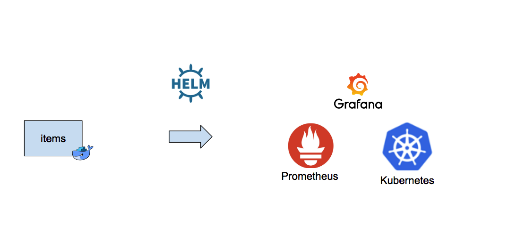
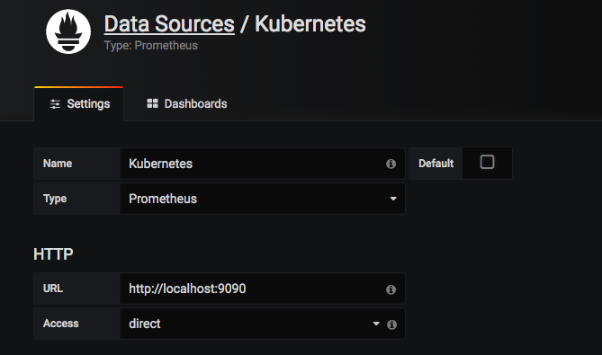

# metrics-tutorial
This tutorial will walk through the following:
- install promethus & grafana using helm
- add metrics to a docker service and deploy it to kubernetes
- monitor the service from grafana

**Prerequisites**: install docker, Kubernetes and helm and clone repo.



Install Prometheus
```
$ $ helm install --name prometheus stable/prometheus
NAME:   prometheus
...
For more information on running Prometheus, visit:
https://prometheus.io/

$ helm ls
NAME      	REVISION	UPDATED                 	STATUS  	CHART           	NAMESPACE
prometheus	1       	Sat Apr  7 09:40:01 2018	DEPLOYED	prometheus-6.1.1	default  

$ kubectl get pods
NAME                                             READY     STATUS    RESTARTS   AGE
prometheus-alertmanager-85d944f874-g5znl         1/2       Running   0          45s
prometheus-kube-state-metrics-786b6cbc77-bwhv4   1/1       Running   0          45s
prometheus-node-exporter-9h8p4                   1/1       Running   0          45s
prometheus-pushgateway-68966b6ff7-p4rgs          1/1       Running   0          45s
prometheus-server-6966b574d7-6tm8g               1/2       Running   0          45s

```

Port forward Prometheus to open in the browser
```
$ kubectl port-forward prometheus-server-6966b574d7-6tm8g 9090
Forwarding from 127.0.0.1:9090 -> 9090
```
> Browse to http://localhost:9090/graph to see Prometheus


Install Granafa
```
$ helm install --name grafana stable/grafana
NAME:   grafana
...
NOTES:
1. Get your 'admin' user password by running:

   kubectl get secret --namespace default grafana -o jsonpath="{.data.grafana-admin-password}" | base64 --decode ; echo

2. The Grafana server can be accessed via port 80 on the following DNS name from within your cluster:

   grafana.default.svc.cluster.local

   Get the Grafana URL to visit by running these commands in the same shell:

     export POD_NAME=$(kubectl get pods --namespace default -l "app=grafana-grafana,component=grafana" -o jsonpath="{.items[0].metadata.name}")
     kubectl --namespace default port-forward $POD_NAME 3000

3. Login with the password from step 1 and the username: admin

```

Generate admin password
```
$ kubectl get secret --namespace default grafana -o jsonpath="{.data.grafana-admin-password}" | base64 --decode ; echo
xxxxxxxx
```

Port forward Grafana
```
$ kubectl get pods
NAME                                             READY     STATUS    RESTARTS   AGE
grafana-55b57d567b-2gvtk                         0/1       Running   0          12s
prometheus-alertmanager-85d944f874-64ml2         2/2       Running   0          2m
prometheus-kube-state-metrics-786b6cbc77-v8cxd   1/1       Running   0          2m
prometheus-node-exporter-76tsc                   1/1       Running   0          2m
prometheus-pushgateway-68966b6ff7-kgmf8          1/1       Running   0          2m
prometheus-server-6966b574d7-5xjrz               2/2       Running   0          2m


$ kubectl port-forward grafana-55b57d567b-2gvtk 3000
Forwarding from 127.0.0.1:3000 -> 3000
```

> Browse to http://localhost:3000 to see Grafana


Configure Grafana to connect to Prometheus:




Build the docker image locally which contains the service we want to monitor:
```
$ make build-docker
./build-docker.sh metrics-tutorial latest Dockerfile
Sending build context to Docker daemon  198.1kB
Step 1/19 : FROM golang:1.10-alpine AS builder
1.10-alpine: Pulling from library/golang
ff3a5c916c92: Already exists
f32d2ea73378: Pull complete
dbfec4c268d3: Pull complete
...Successfully built 3af201e32085
Successfully tagged metrics-tutorial:latest
```

Try out the service
```
$ docker-compose up -d
Starting items ... done

$ curl localhost:8080/items
[{"item":"apple"}, {"item":"orange"}, {"item":"pear"}]

$ docker-compose down
```

Deploy the service to Kubernetes using Helm
```
$ helm install --name items ./charts/items
```

Verify the service is running in Kubernetes
```
$ kubectl port-forward items-d5b6bf545-fxh9z 8080
(from another terminal session)
$ curl localhost:8080/items
[{"item":"apple"}, {"item":"orange"}, {"item":"pear"}]
```


add prometheus client and metrics handler
```
$ vi main.go
import (
	"io"
	"math/rand"
	"net/http"
	"os"
	"strconv"
  // -----------------------------------------------
  //
	"github.com/prometheus/client_golang/prometheus/promhttp"
  //
  //           ^^^ add line    
	// -----------------------------------------------
)

// ItemList : list of items
type ItemList []struct {
	Item string `json:"item"`
}

func main() {
	http.HandleFunc("/items", items)
	http.HandleFunc("/", health)

	// -----------------------------------------------
	//
  http.Handle("/metrics", promhttp.Handler())
  //
  //           ^^^ add line    
	// -----------------------------------------------
```

get prometheus go client
```
$vi build.sh
(add go get before go build)
go get github.com/prometheus/client_golang/prometheus

```

update the service.yaml file to enable prometheus:
```
$ vi charts/items/templates/service.yaml
apiVersion: v1
kind: Service
metadata:
  name: {{ template "items.fullname" . }}
  labels:
    app: {{ template "items.name" . }}
    chart: {{ template "items.chart" . }}
    release: {{ .Release.Name }}
    heritage: {{ .Release.Service }}
  # -------------------------------------------
  #
  annotations:
    prometheus.io/scrape: "true"
    prometheus.io/port: {{ .Values.service.port | quote }}
  #
  #             ^^^ add lines
  # -------------------------------------------
spec:
  type: {{ .Values.service.type }}
  ports:
    - port: {{ .Values.service.port }}
      targetPort: http
      protocol: TCP
      name: http
  selector:
    app: {{ template "items.name" . }}
    release: {{ .Release.Name }}
```

build container and re-install chart
```
$ make build-docker

$ helm del --purge items
$ helm install --name items ./charts/items
```
